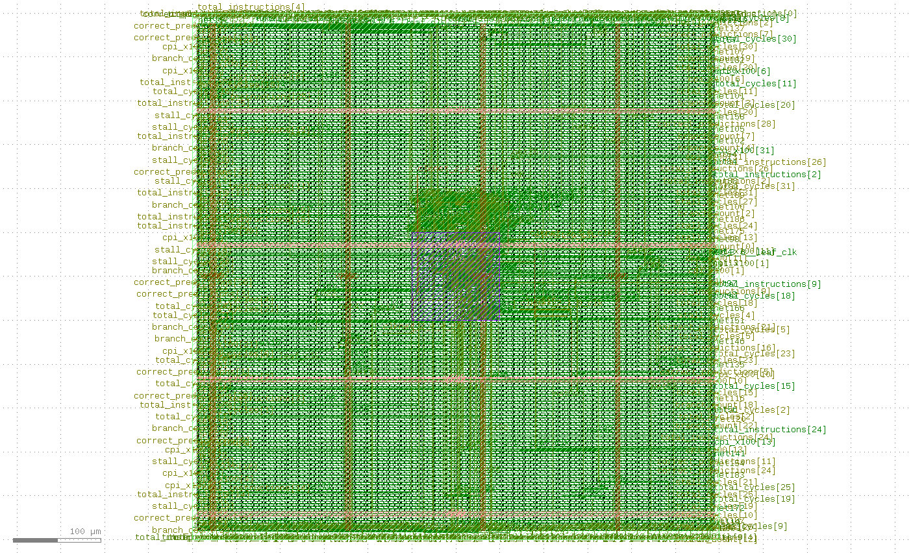

# RISC-V Pipelined Processor — RTL to Silicon

> Built independently as a 3rd year Electronics (VLSI) undergraduate.
> This project covers the complete semiconductor design flow from
> writing Verilog HDL all the way to a physical chip layout on the
> SkyWater 130nm open-source PDK.

---

## Project Overview

This project implements a fully functional 32-bit RISC-V processor
from scratch. Every module was written in Verilog, verified through
cycle-accurate simulation in Vivado, and then taken through the
complete physical design flow using OpenLane to produce a GDS chip
layout file that is DRC clean and LVS verified.

The goal was to demonstrate end-to-end chip design capability —
from RTL to tape-out ready silicon — using industry standard tools
and open-source PDKs.

---

## Complete Design Flow
---

## Pipeline Architecture

The processor implements a classic 5-stage pipeline where five
different instructions execute simultaneously in different stages,
dramatically improving throughput over single-cycle designs.
RISC-V 5-Stage Pipeline
________________________________________________________
---

## Modules Built

### Core Pipeline Stages
| Module | Function |
|---|---|
| if_stage.v | Fetches instruction from memory using PC |
| id_stage.v | Decodes instruction, reads registers, generates control signals |
| ex_stage.v | ALU executes operation, computes branch target |
| mem_stage.v | Reads or writes data memory |
| wb_stage.v | Writes result back to register file |

### Pipeline Registers
| Module | Function |
|---|---|
| if_id_reg.v | Holds IF stage outputs for ID stage |
| id_ex_reg.v | Holds ID stage outputs for EX stage, supports flush |
| ex_mem_reg.v | Holds EX stage outputs for MEM stage |
| mem_wb_reg.v | Holds MEM stage outputs for WB stage |

### Hazard Handling
| Module | Function |
|---|---|
| hazard_unit.v | Detects load-use hazards, generates stall and flush signals |
| forwarding_unit.v | Selects correct ALU input from MEM or WB stage |

### Advanced Features
| Module | Function |
|---|---|
| branch_predictor.v | 2-bit saturating counter, learns branch patterns |
| performance_counter.v | Tracks cycles, instructions, stalls, CPI |
| uart_tx.v | Serial transmitter at 115200 baud |
| cache.v | Direct-mapped L1 cache with hit/miss tracking |
| multiplier.v | RV32M multiply extension (MUL, MULH, MULHU, MULHSU) |
| exception_handler.v | Detects illegal instructions and memory faults |

---

## Simulation Results

Program used — Fibonacci sequence, which tests arithmetic instructions,
register file read/write, and pipeline correctness across 15 instructions.

| Metric | Value |
|---|---|
| Total Cycles | 30 |
| Total Instructions | 15 |
| Stall Cycles | 0 |
| CPI | 1.93 |
| Branch Count | 0 |

All 15 instructions executed correctly with zero stalls, confirming
that the forwarding unit successfully eliminated all data hazards.

Cycle by cycle output:
---

## Physical Design Results

| Parameter | Value |
|---|---|
| PDK | SkyWater 130nm open-source |
| Standard Cell Library | sky130_fd_sc_hd |
| Die Area | 600 x 600 micrometers |
| DRC Violations | 0 |
| LVS Status | Clean |
| Flow Tool | OpenLane v1.0.2 |
| Flow Steps Completed | 42 of 42 |

---

## Tools and Technologies

| Category | Tool |
|---|---|
| HDL | Verilog (RTL design) |
| Simulation | Vivado 2023.2 (Xilinx XSim) |
| Synthesis | Yosys (via OpenLane) |
| Place and Route | OpenROAD (via OpenLane) |
| DRC | Magic VLSI |
| LVS | Netgen |
| GDS Viewer | KLayout 0.30.8 |
| PDK | SkyWater 130nm |
| Container | Docker on WSL2 Ubuntu 22.04 |
| Target FPGA | Artix-7 xc7a35tcpg236-1 |

---

## Repository Structure
---

## Novelty and Significance

1. End to end flow — most student projects stop at RTL simulation.
   This project goes all the way to a manufacturable GDS chip layout.

2. Open source stack — the entire physical design uses free and open
   tools (OpenLane, OpenROAD, Magic, Yosys) on the SkyWater 130nm PDK,
   the same PDK used by Google sponsored chip shuttle programs.

3. Working silicon design — the layout passed DRC and LVS checks,
   meaning it could theoretically be submitted to a chip foundry.

4. Independent implementation — every line of Verilog was written from
   scratch without copying existing RISC-V implementations.

5. India semiconductor relevance — RISC-V is the ISA chosen by IIT
   Madras for the SHAKTI processor, India's homegrown chip initiative.
   This project aligns directly with that national direction.

---

## About

**Shruthi R**
3rd year B.E Electronics Engineering (VLSI Design and Technology)
RMK Engineering College, Chennai

GitHub: https://github.com/SHRUTHI-R-17
LinkedIn: https://linkedin.com/in/shruthi-r-944b48293

---

*Built using open-source EDA tools. Apache 2.0 License.*
